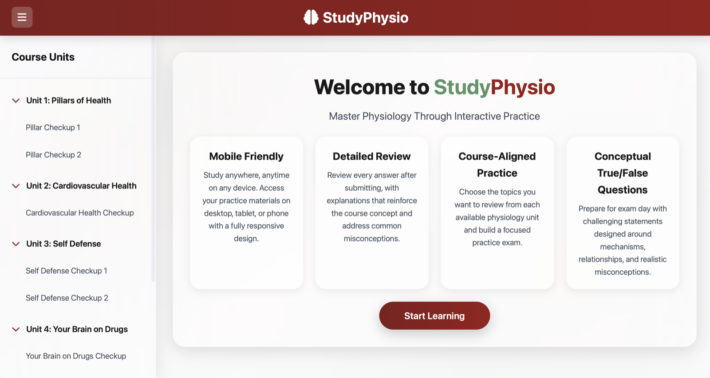

# StudyPhysio

Course-aligned physiology practice through interactive true/false checkups.

[Open StudyPhysio](https://studyphysio.org) · [Contact Roshan](mailto:roshandsaxena@gmail.com)

## Use StudyPhysio

Open [studyphysio.org](https://studyphysio.org), choose a unit, select the topics you want to review, and choose the number of questions. Complete the checkup, then review your score, topic performance, and explanations.

## Features

- Eight physiology checkups
- Topic-focused practice with randomized question selection
- Questions focused on mechanisms, relationships, and common misconceptions
- Detailed explanations after every checkup
